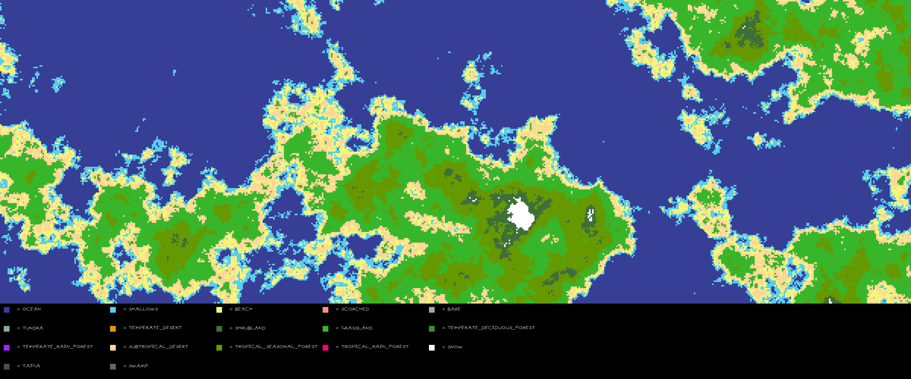
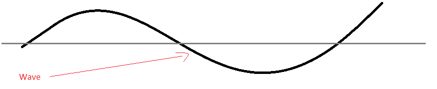
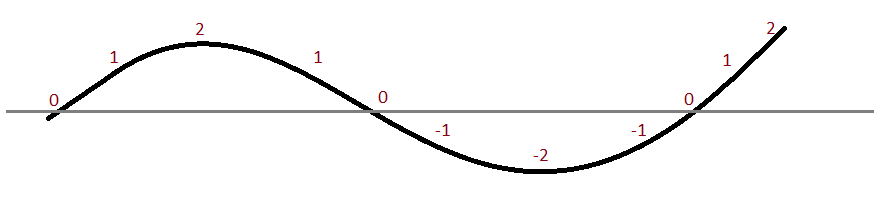
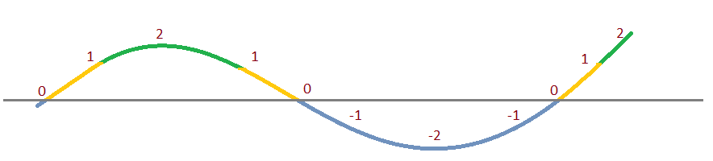
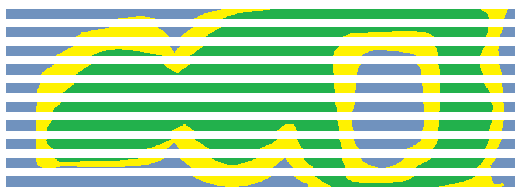
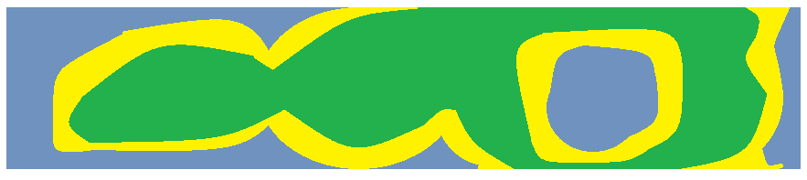
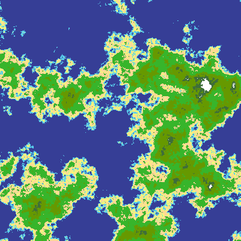
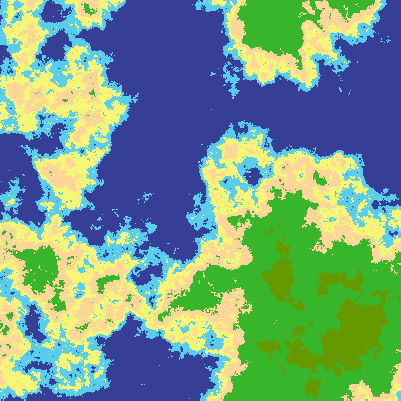
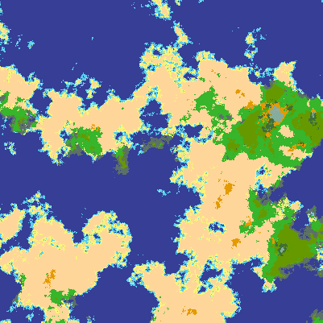

# perlin-noise-2d-terrain-generation

A generator of roguelike style terrain maps made for fun.



## Setup

### Simple:

To use the program you'll require an installation of [Python](https://www.python.org) and then you'll need to install the requirements listed in the requirements.txt.

To do this you can run `pip install -r requirements.txt`. This will install all the requirements and then you can run `python perlin-noise-2d-terrain-generation` to run the program with its default settings.

### Recommended (but optional):

I recommend that you use a [Virtual Environment](https://docs.python-guide.org/dev/virtualenvs/#lower-level-virtualenv) for this and other Python applications so that your main Python installation can be kept clean of program-specific requirements.

## Using the Program

- `python perlin-noise-2d-terrain-generation`
  - This will give you a simple map with the default values.
  - Use the `-h` flag to get a list of things to tweak.

## Theory

To understand how this works and to also be able to use the generator properly, a little theory is required. This program works by generating two noise maps - one for elevation, another for moisture. By interpreting these noise maps together, realistic-looking terrain can be generated.

We'll begin by exploring what a noise map even is.

### Noise

#### Waves

You're probably familiar with what a sound is and you've probably also seen a sound represented in wave form. A wave looks like this:



It's often seen on heart rate monitors and can be smooth as depicted above, or sharp and short. On a heart rate monitor it's often sharp and short.

**Measuring a wave**

A wave can be put on a graph and measured. You see the grey line? That's the baseline and it represents `0`. Everything above it is a positive number, everything below it is a negative number:



**Interpreting a wave**

Now that we have a wave measured, we can choose to interpret its values however we like:



Here, we interpret the wave like this:

| Range | Type  | Color  |
| ---   | ---   | ---    |
| `< 0` | Water | Blue   |
| `< 1` | Sand  | Yellow |
| `< 2` | Grass | Green  |

**Look at the wave from above**

Now that we have our colored wave, look at it from above:


Now imagine many waves all side by side together:



And now if we put them close together we get a map:



**Representing a wave as a list of numbers**

In programming terms, a wave is to us simply a list of numbers like this: `[0, 1, 2, 1, 0, -1, -2, -1, 0, 1, 2]`, taken straight from the graph.

#### Noise Map

A noise map is just a collection of waves. For example:

```
noise_map = [
    [-2, -2, -1, 0, 0, 1, 1, 2, 2, 1, 1, 0, -1, -2, -2],
    [-2, -1, 0, 0, 0, 1, 1, 2, 2, 1, 1, 0, 0, -1, -2],
    [-1, -2, -1, 0, 0, 1, 1, 2, 2, 1, 1, 0, -1, -2, -2]
    ]
```

When we draw the waves together, they become a map.

##### Generating waves with Simplex and Perlin

In order to generate waves to make a convincing looking map, you can't just generate random numbers because it will be too random and won't form convincing landmasses.

What we want is similar to the effect of dropping a pebble into a pool of water: we want the ripples to move uniformly outwards from a point. This way the waves have some kind of relationship to each other.

To achieve this, we use an algorithm like [Simplex noise](https://en.wikipedia.org/wiki/Simplex_noise) or [Perlin noise](https://en.wikipedia.org/wiki/Perlin_noise).

When we use these algorithms we get waves which can be rendered as convincing landmasses. Here's an example:

| Simplex | Perlin |
| --- | --- |
|  |  |

Both maps have the same dimensions and settings, but produce different results. Perlin tends to be a bit smoother, hence its longer and shallower landmasses. Simplex tends to be higher and lower, which is why you can see some snowy mountain tops in its image.

I tend to prefer Simplex, but either algorithm can produce amazing results and I encourage you to experiment with both.

###### Settings

The variables that can be tweaked in the algorithm are:

| Variable(s) | Explanation |
| --- | --- |
| `tilesize` | The size of the square tile in pixels. |
| `width, height` | The width and height of the map in tile sizes. |
| `octaves` | The level of detail. Lower = more peaks and valleys, higher = less peaks and valleys. |
| `lacunarity` | The level of detail on each octave (adjusts frequency). |
| `persistence` | How much an octave contributes to overall shape (adjusts amplitude). |
| `scale` | The scale of the map. Higher = zoomed in, lower = zoomed out. |


#### A Map for Elevation and another for Moisture

If you create maps with just elevation alone, you don't get enough interesting variety in the terrain. What I do to get more interesting results is I generate a second noise map for moisture content:

- Elevation map
  - Controls the terrain: water, land, hills, mountains, etc.
- Moisture map
  - Controls the moisture over that terrain.

The moisture content on a land tile could determine the difference between a scorching desert, a grassy meadow or a rainforest. These are called **biomes**.

There's the following biomes available:

- `OCEAN`
- `SHALLOWS`
- `SWAMP`
- `BEACH`
- `SCORCHED`
- `BARE`
- `TUNDRA`
- `TEMPERATE_DESERT`
- `SHRUBLAND`
- `GRASSLAND`
- `TEMPERATE_DECIDUOUS_FOREST`
- `TEMPERATE_RAIN_FOREST`
- `SUBTROPICAL_DESERT`
- `TROPICAL_SEASONAL_FOREST`
- `TROPICAL_RAIN_FOREST`
- `SNOW`
- `TAIGA`

By adjusting moisture, the same map can have very different terrain:

| Normal Moisture | Altered Moisture |
| --- | --- |
|  |  |

## Future Features

Features planned but not yet implemented:

- `--sinkedges`
  - This flag will sink the edges of the map into the ocean to make islands.
- `--southpole`, `--northpole`
  - These flags will create poles on the map so that the top and bottom of the map are icy and cold.

## Author

Joshua Woods - [Github](https://github.com/jpw1991/)
